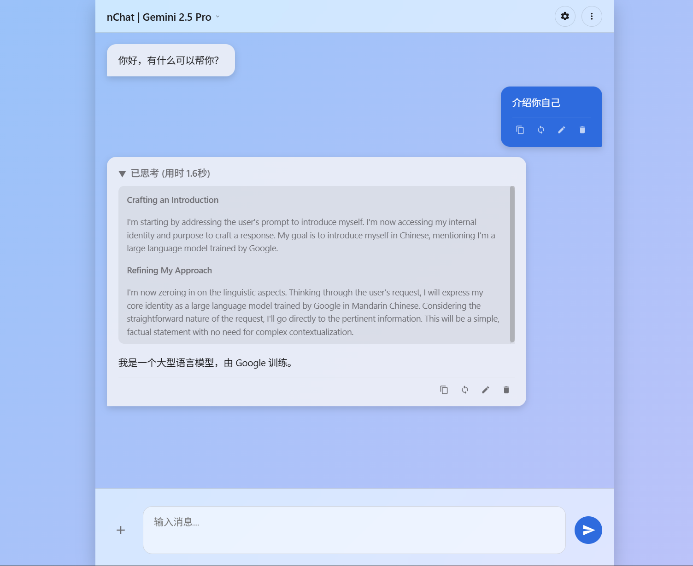

# nChat 🤖

一个设计精美、轻量高速、无需后端的 AI 聊天前端界面。所有功能都在您的浏览器中本地运行，为您提供一个私密、可高度定制的聊天体验。

## ✨ 主要功能

- **完全本地化**: 作为一个单页 HTML 应用，无需服务器或复杂的安装过程。下载后即可在浏览器中直接使用。
- **移动端支持**: 为移动端访问做适配。
- **多配置管理**:
    - 创建并保存多个独立的聊天配置（API 地址、密钥、模型、系统提示词等）。
    - 在不同配置间一键快速切换。
    - 支持导入和导出配置 JSON 文件，方便备份和分享。
- **强大的兼容性**: 支持任何与 OpenAI API 格式兼容的接口，支持思考过程显示。
- **多模态视觉能力**: 支持上传和发送图片，与视觉模型（如 GPT-4o, Gemini）进行交互。
- **丰富的聊天体验**:
    - 支持 Markdown 语法渲染，包括代码块、表格、列表等。
    - 对话历史管理：可对已发送的消息进行**编辑**、**重新生成**、**复制**或**删除**。
    - 将完整对话导出为 Markdown 文件。
- **高度可定制**:
    - 提供**浅色**和**深色**两种主题模式。
    - 可自定义系统提示词 (System Prompt) 来设定 AI 的角色和行为。
    - 可调整高级参数，如 `Temperature` 和 `Top P`，以控制生成内容的多样性。
- **注重隐私**: 您的 API 密钥和聊天记录仅存储在浏览器的 `localStorage` 中，不会发送到任何第三方服务器。

## 🚀 如何开始

1.  **下载文件**: 下载 `index.html` 文件。
2.  **准备依赖**: (可选) 创建一个名为 `js` 的文件夹，并将 `marked.min.js` 和 `purify.min.js` 放入其中。也可以添加为链接动态获取。
3.  **打开应用**: 在您喜欢的现代浏览器（如 Chrome, Firefox, Edge）中打开 `index.html` 文件。

## ⚙️ 基础配置

首次使用时，您需要进行以下配置：

1.  点击页面顶部的**设置图标** ⚙️ 打开设置面板。
2.  **配置名称**: 为您当前的设置起一个容易识别的名字（例如：“GPT-4o 编程助手”）。
3.  **API URL**: 填入您的 AI 服务提供商的 API 地址 (Base URL)。
    - 例如 OpenAI 官方: `https://api.openai.com/v1`
4.  **API Key**: 填入您的 API 密钥。该密钥将被安全地存储在浏览器本地。
5.  **Model ID**: 填入您希望使用的模型名称。
    - 例如: `gpt-4o`, `gemini-2.5-pro`
6.  **系统提示词 (System Prompt)**: (可选) 输入系统提示词来指导 AI 的行为。
    - 例如: `你是一个专业的全栈工程师，请用中文回答。`
7.  **保存配置**: 点击右下角的“保存配置”按钮。

完成以上步骤后，您就可以开始聊天了！

## 🔧 详细功能说明

### 配置管理

- **新建配置**: 点击配置选择下拉框旁边的 `+` 按钮。
- **删除配置**: 点击 `-` 按钮删除当前选中的配置。
- **快速切换**: 点击页面顶部的标题，可以在下拉菜单中快速切换不同的配置。

### 高级参数

在设置面板中，点击“高级参数设置”可以展开更多选项：

- **Temperature**: 控制生成文本的随机性。值越高（如 1.0），回答越具创造性；值越低（如 0.2），回答越确定和一致。
- **Top P**: 一种替代 Temperature 的采样方法。模型会从概率最高的词汇中进行选择，直到累积概率达到 Top P 的值。

### 聊天交互

- **发送图片**: 点击输入框左侧的 `+` 图标上传图片（最多5张）。
- **停止生成**: 在 AI 回复过程中，发送按钮会变为一个停止图标，点击可中断当前的响应。
- **消息操作**: 每条消息下方都有一组操作按钮：
    - **复制**: 复制消息内容到剪贴板。
    - **重新生成**: 基于当前消息上下文，让 AI 重新生成一次回答。
    - **编辑**: 修改您发送的消息内容，修改后会自动触发 AI 基于新内容生成回答。
    - **删除**: 从对话历史中移除该条消息。

## 🛠️ 技术栈

- **HTML5**
- **CSS3** (原生实现，无框架)
- **JavaScript (ES6+)** (原生实现，无框架)
- **marked.js**: 用于将 Markdown 文本解析为 HTML。
- **DOMPurify**: 用于清理和防范 XSS 攻击，确保渲染内容的安全性。

## 📄 许可

本项目采用 [MIT License](https://opensource.org/licenses/MIT) 开源。